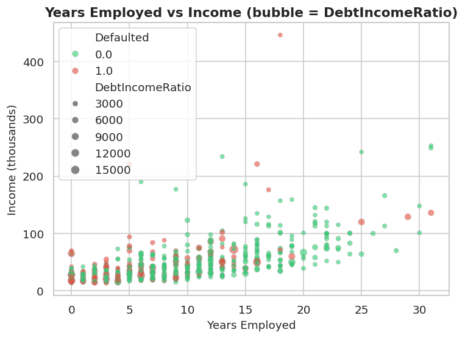
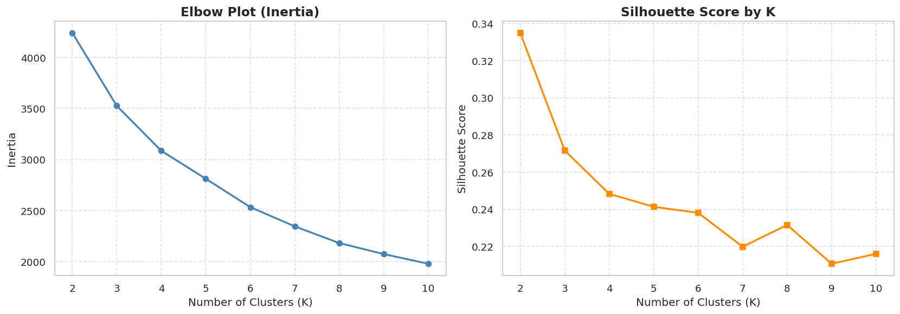
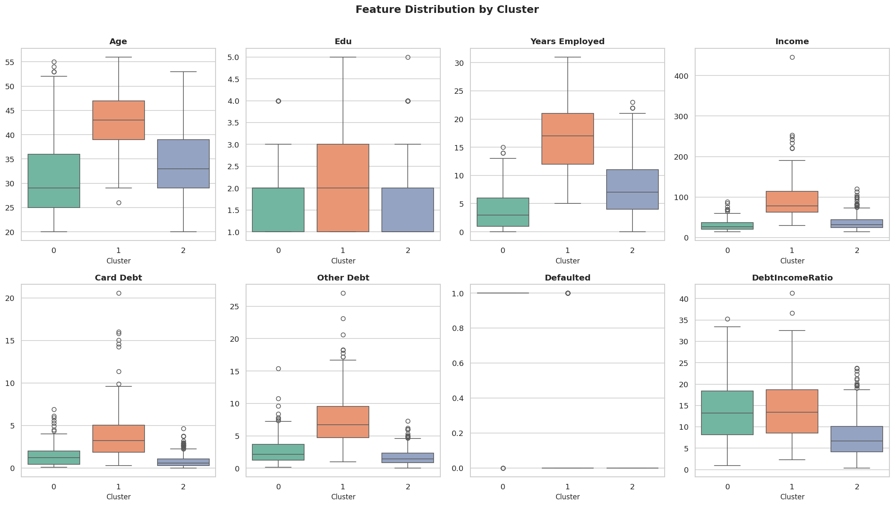
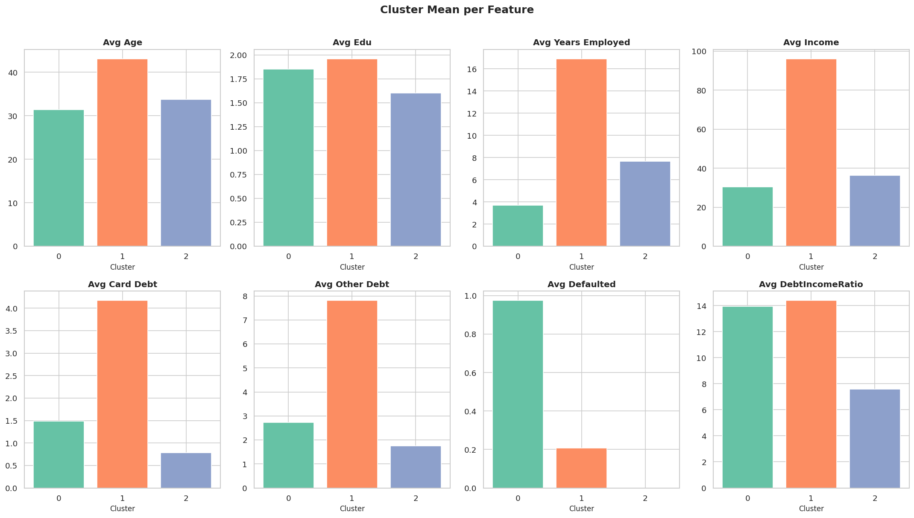
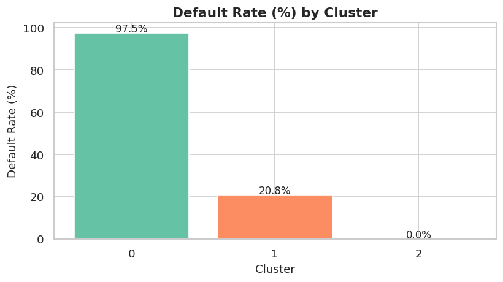
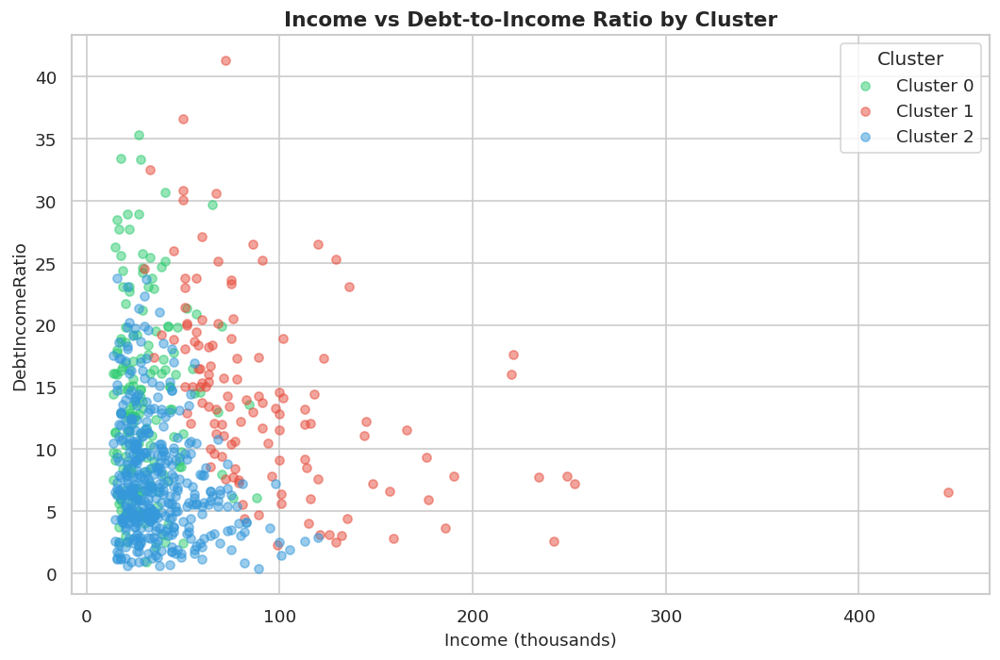

# Customer Segmentation using KMeans Clustering

A KMeans-based customer segmentation project for a credit card company.  
The goal is to group customers by demographic and financial characteristics to support targeted marketing decisions.

---

## Business Context

A credit card company wants to understand who its customers are — not just as data points, but as people with different financial realities. By segmenting customers, the company can stop applying a one-size-fits-all approach and instead allocate marketing resources where they will actually work.

---

## Dataset

- **Source:** [IBM Sample Data](https://www.kaggle.com/datasets/arjunbhasin2013/ccdata)  
- **Shape:** 850 rows × 8 features (700 after cleaning)
- **Missing values:** 150 NaN entries in `Defaulted` — dropped, not imputed (binary labels cannot be safely guessed)

| Feature | Description |
|---|---|
| Age | Customer age |
| Edu | Education level (ordinal: 1–5) |
| Years Employed | Years in current or recent employment |
| Income | Annual income (thousands) |
| Card Debt | Outstanding credit card debt |
| Other Debt | Other outstanding debt |
| Defaulted | Whether the customer defaulted (0 = No, 1 = Yes) |
| DebtIncomeRatio | Total debt as a percentage of income |

---

## Methodology

1. Drop identifier columns (`Unnamed: 0`, `Customer Id`)
2. Drop rows where `Defaulted` is NaN
3. Scale all features with `StandardScaler` — required for KMeans since it is distance-based
4. Evaluate K from 2 to 10 using Elbow Plot (inertia) and Silhouette Score
5. Fit final KMeans model with chosen K
6. Analyze and visualize cluster profiles

---

### EDA: Years Employed vs Income



Defaulted customers (red) concentrate among low-income, early-career individuals with fewer
than 15 years of employment. Bubble size represents DebtIncomeRatio — the largest bubbles
in the bottom-left confirm these customers carry the highest debt relative to what they earn.
This pattern appears in the raw data before any clustering runs, and it directly maps onto
what KMeans later identifies as Cluster 0.

---

## Choosing K

Both metrics were evaluated across K = 2 to 10.



| K | Inertia | Silhouette |
|---|---|---|
| 2 | 4240.42 | 0.3350 |
| **3** | **3525.31** | **0.2716** |
| 4 | 3085.45 | 0.2483 |
| 5 | 2811.62 | 0.2414 |

**Chosen K = 3.**

K=2 has the highest silhouette score mathematically, but produces segments too coarse to act on. The elbow bends sharpest between K=2 and K=3. After K=3, both inertia and silhouette flatten with no meaningful gain. K=3 gives three distinct, interpretable customer profiles — which is what the business needs.

---

## Cluster Results

### Feature Distribution by Cluster



### Cluster Mean per Feature



### Default Rate by Cluster



### Income vs Debt-to-Income Ratio



---

## Cluster Descriptions

### Cluster 0 — The Overextended & Defaulted

**Profile:** Young customers (~32), early in their careers (~4 years employed), with low income (~30k) and high debt-to-income ratios. Nearly all (97.5%) have already defaulted.

**Beyond the numbers:** These are people who likely got access to credit before they had the financial foundation to manage it. Low income, short employment history, and high relative debt is a combination that leads to default. They are not necessarily irresponsible — they may simply have been overextended at a vulnerable life stage.

**Insight:** This cluster was not identified by debt amount alone — their absolute debt is actually low. What defined them is the ratio: they owe a lot relative to what they earn. A debt-to-income ratio of ~14 on a 30k income is very different from the same ratio on a 95k income.

---

### Cluster 1 — The High Earners with Leverage

**Profile:** Older customers (~45), long employment history (~17 years), highest income (~95k), and the highest absolute debt levels. Default rate is 20.8% — present but not negligible.

**Beyond the numbers:** These are established professionals who actively use credit as a financial tool. They carry real debt — card and other — but their income gives them room. The 1-in-5 default rate suggests a subset that over-leveraged despite high earnings, possibly due to lifestyle inflation or economic shocks rather than structural poverty.

**Insight:** High income does not mean low risk. This cluster earns the most but still has a meaningful default rate. A lender who targets this group purely on income without examining total debt load is taking on hidden risk.

---

### Cluster 2 — The Financially Conservative

**Profile:** Mid-age customers (~35), moderate income (~37k), moderate employment (~8 years). Lowest debt across all features. Zero defaults — 0.0%.

**Beyond the numbers:** These customers are not wealthy, but they are careful. They do not over-borrow relative to what they earn, and the data shows it — a DebtIncomeRatio of ~7.5 is the lowest of all three groups. They represent the reliable, underutilized segment: creditworthy but probably not being marketed to aggressively because they do not look as "valuable" as Cluster 1.

**Insight:** A zero default rate on a segment of moderate earners is a strong signal of credit discipline. This group is low-risk and likely under-served with premium products they would actually qualify for and responsibly use.

---

## Business Recommendations

**Recommendation 1: Do not market new credit products to Cluster 0.**  
A 97.5% default rate is a risk management signal, not a marketing problem. Offering higher credit limits or new cards to this segment will increase chargeoffs. If the company wants to engage them at all, the right product is a secured card with a hard credit limit tied to a deposit, paired with financial literacy messaging. The goal is rebuilding, not expanding.

**Recommendation 2: Cluster 2 is the primary acquisition target.**  
Zero defaults, moderate but stable income, low debt burden — this is the segment where a rewards card or a low-APR everyday card will perform well. They have the discipline to carry a card without defaulting, and they are likely not being offered premium products because their income is not eye-catching. That is the opportunity. Market to them on reliability and value, not on status or high spending limits.

**Recommendation 3: Cluster 1 needs product-level segmentation.**  
The 20.8% default rate inside the highest-income group means this segment is not uniform. A travel rewards or premium card makes sense for low-debt members of this cluster. However, the company should use `DebtIncomeRatio` as a secondary filter — members of Cluster 1 with a ratio above 20 should be handled more carefully regardless of income level.

---

## Project Structure

```
├── customer_segmentation_kmeans.ipynb   # Main notebook
├── customer_data.csv                    # Input data
├── elbow_silhouette.png                 # K selection plots
├── cluster_boxplots.png                 # Feature distributions by cluster
├── cluster_means.png                    # Cluster mean per feature
├── default_rate_by_cluster.png          # Default rate per cluster
├── scatter_income_debt.png              # Income vs DebtIncomeRatio scatter
└── README.md
```

---

## Requirements

```
pandas
numpy
matplotlib
seaborn
scikit-learn
```

Install with:

```bash
pip install pandas numpy matplotlib seaborn scikit-learn
```

---

## Author

Ali Abu Sohiban  
Biotechnology Graduate — Islamic University of Gaza  
Data Science & Bioinformatics
